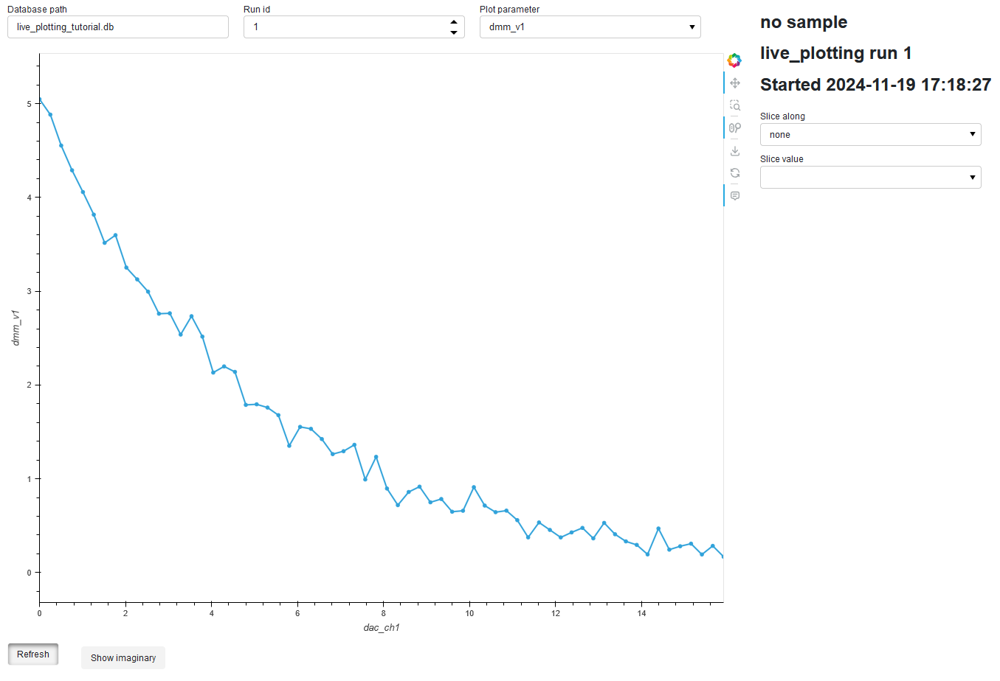
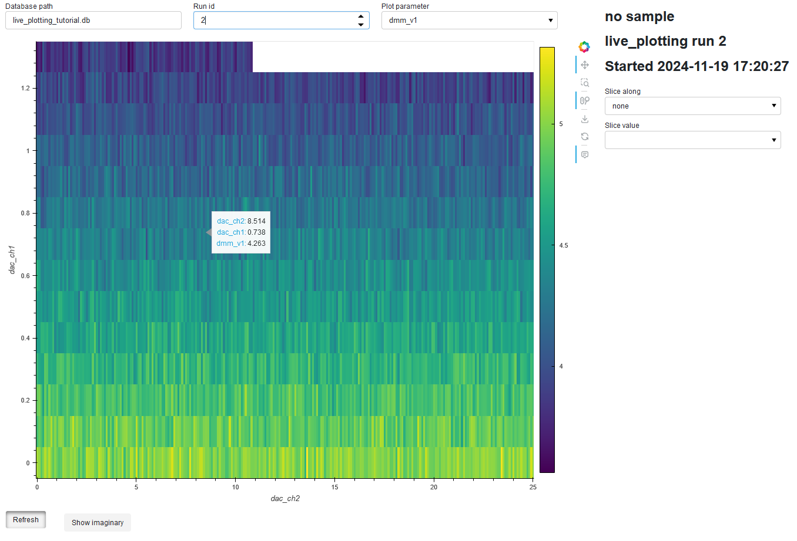

# QC plot

Quick live plotting for data recorded using [qcodes](http://microsoft.github.io/Qcodes/).

Data is loaded using SQL queries and displayed through a web interface.

## Features
- Web interface based on [Panel](https://panel.holoviz.org/)
- Quickly loads and displays data
- Live plotting
- Supports 1D and 2D data
- 1D cuts through 2D datasets

## Conda installation

Clone the git repository

`git clone https://github.com/lewisgpowell/qc_plot`

`cd qc_plot`

Create a conda environment with all the necessary dependencies

`conda env create -f environment.yml`

## Usage

Run `python panel_gui.py` from the conda terminal to launch the web server.

See `live_plotting.ipynb` for a tutorial.
